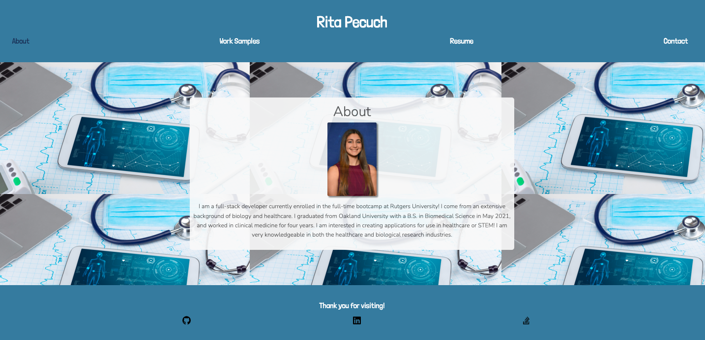

# Professional Portfolio

## Description

The purpose of this project was to build a professional portfolio that I can use to showcase my work to potential employers. This will allow hiring managers to view all of my information, work samples, and contact information in one place. While building this project, I gained experience using React and React libraries. This portfolio will continue to be updated as I learn new skills and deploy more applications.

## Usage

To access this webpage, visit the following URL: [https://rpecuch.github.io/react-portfolio/](https://rpecuch.github.io/react-portfolio/). Users may navigate to specific sections using the links in the header of the page. The footer contains links to my GitHub, LinkedIn, and Stack Overflow profiles.

The "About" section shows a short summary about my background.

The "Work Samples" section shows a slideshow of some of the projects I have made. Click on any of the indicators on the bottom of the screen to jump to a specific project. To view a deployed application, click on the name of the application. To view a GitHub repository, click on the GitHub icon.

The "Resume" section shows a PDF file of my resume and a list of some of my proficiencies.

The "Contact" section displays my contact information and a contact form. If any of the fields are left blank, a message will display indicating which field still needs to be filled in. If the form is submitted with an invalid email or any of the fields are left blank, an error message will appear. If the form is submitted successfully, a success message will appear and the form fields will reset to blank.

## License

Please refer to the license in the repo.
